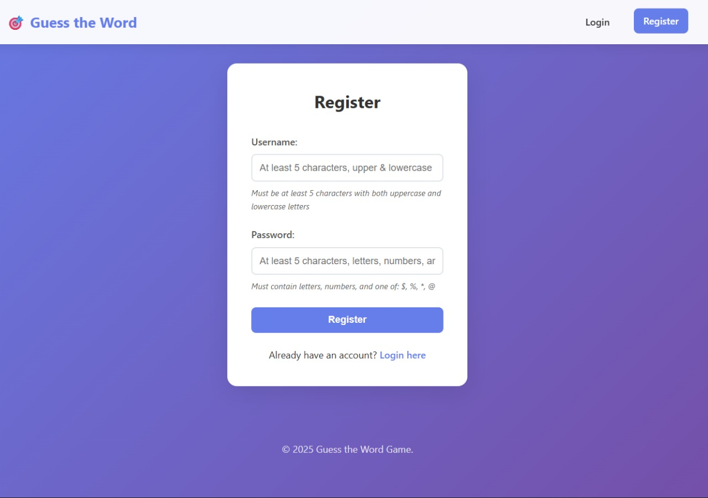
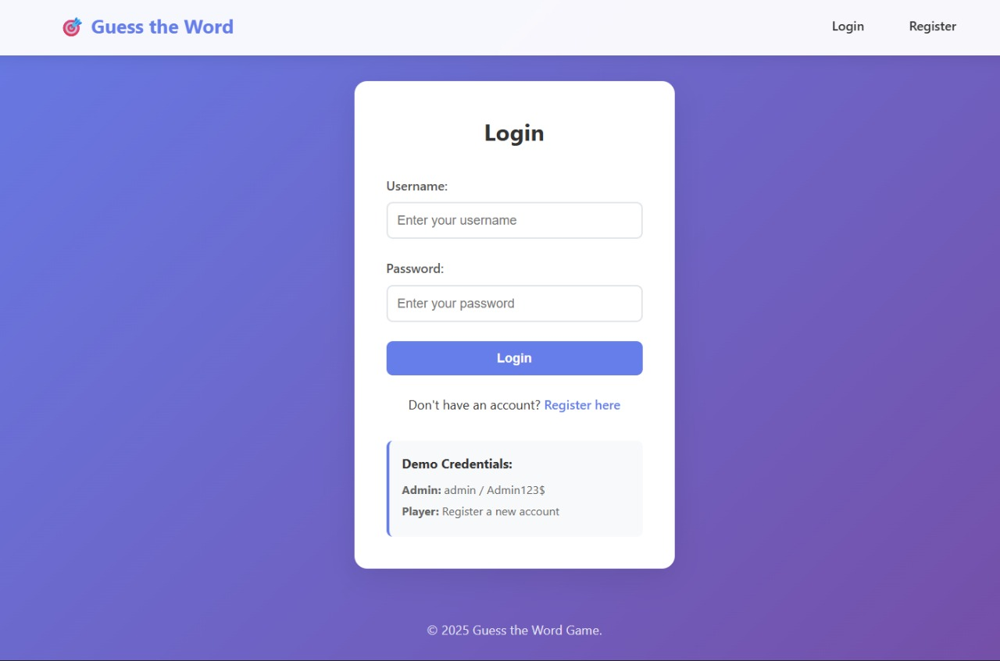
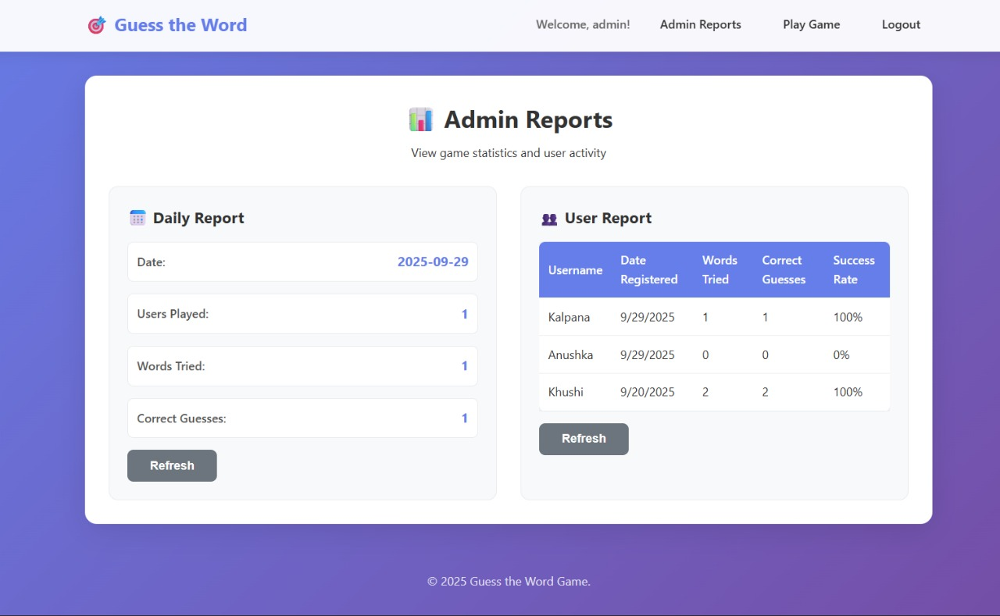
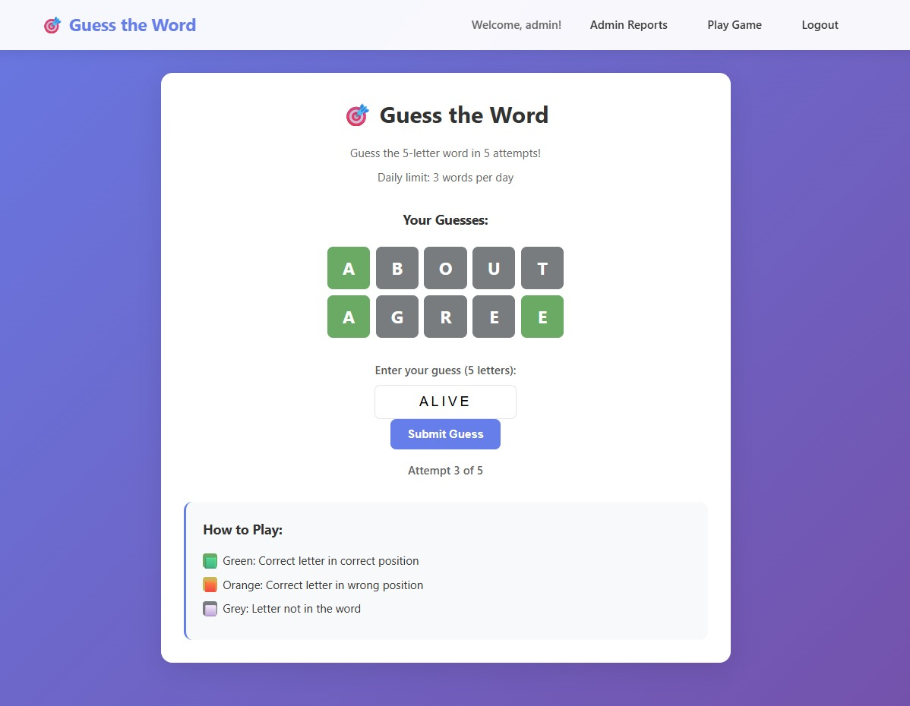
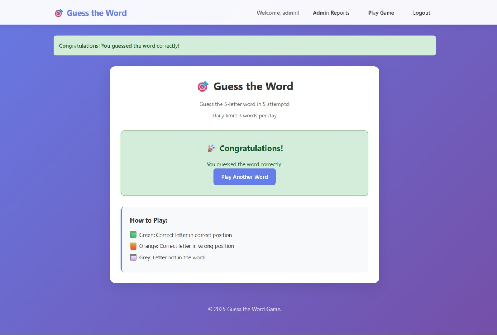

# 🎯 Guess the Word Game

A Wordle-style word guessing game built with Python Flask, SQLite, and modern web technologies. Players can register, login, and play a daily word guessing game with admin reporting capabilities.

## 🚀 Features

### User Management

- **User Registration & Login**: Secure authentication with password hashing
- **Username Validation**: At least 5 characters with uppercase and lowercase letters
- **Password Requirements**: At least 5 characters with letters, numbers, and special characters ($, %, \*, @)
- **Role-based Access**: Admin and Player roles with different permissions

### Game Features

- **Daily Word Limit**: Players can guess up to 3 words per day
- **5 Attempts per Word**: Each word allows maximum 5 guesses
- **Wordle-style Feedback**:
  - 🟩 Green: Correct letter in correct position
  - 🟧 Orange: Correct letter in wrong position
  - ⬜ Grey: Letter not in the word
- **Game History**: View all previous guesses with color-coded feedback
- **Win/Lose Detection**: Automatic game state management

### Admin Features

- **Daily Reports**: View daily statistics (users played, words tried, correct guesses)
- **User Reports**: Track individual user performance and success rates
- **Real-time Data**: Live statistics with refresh capabilities

## 🛠️ Tech Stack

- **Backend**: Python Flask
- **Database**: SQLite
- **Frontend**: HTML5, CSS3, JavaScript
- **Authentication**: Werkzeug password hashing
- **Styling**: Modern CSS with responsive design

## 📁 Project Structure

```
project/
├── app.py                 # Main Flask application
├── init_db.py            # Database initialization script
├── requirements.txt      # Python dependencies
├── README.md            # Project documentation
├── templates/           # HTML templates
│   ├── base.html        # Base template
│   ├── login.html       # Login page
│   ├── register.html    # Registration page
│   ├── play.html        # Game interface
│   └── admin_reports.html # Admin dashboard
└── static/
    └── style.css        # CSS styling
```

## 🚀 Quick Start

### Prerequisites

- Python 3.7 or higher
- pip (Python package installer)

### Installation

1. **Clone or download the project**

   ```bash
   cd project
   ```

2. **Install dependencies**

   ```bash
   pip install -r requirements.txt
   ```

3. **Initialize the database**

   ```bash
   python init_db.py
   ```

   This will:

   - Create the SQLite database
   - Set up all required tables
   - Insert 20 sample five-letter words
   - Create a default admin user

4. **Run the application**

   ```bash
   python app.py
   ```

5. **Access the game**
   - Open your browser and go to `http://localhost:5000`
   - Use the demo credentials or register a new account

## 🖼️ Screenshots

### Register Page



### Login Page



### Player Dashboard


### Admin Dashboard



### Game Interface



### Game Completion



## 👤 Demo Credentials

### Admin Account

- **Username**: `admin`
- **Password**: `Admin123$`

### Player Account

- Register a new account using the registration form

## 🎮 How to Play

1. **Register/Login**: Create an account or login with existing credentials
2. **Start Game**: Click "Start New Game" to begin
3. **Make Guesses**: Enter 5-letter words and submit
4. **Analyze Feedback**: Use the color-coded feedback to improve your next guess
5. **Win or Lose**: Guess the word in 5 attempts or try again tomorrow

### Game Rules

- Each word allows 5 attempts maximum
- Players can play up to 3 words per day
- Words are 5 letters long and in uppercase
- Feedback shows letter positions and correctness

## 📊 Admin Features

### Daily Report

- Number of users who played today
- Total words attempted today
- Number of correct guesses today

### User Report

- Individual user statistics
- Words tried and success rate
- Registration dates and activity

## 🗄️ Database Schema

### Users Table

- `id`: Primary key
- `username`: Unique username
- `password_hash`: Hashed password
- `role`: 'admin' or 'player'
- `date_registered`: Registration timestamp

### Words Table

- `id`: Primary key
- `word`: 5-letter word (uppercase)

### Guesses Table

- `id`: Primary key
- `user_id`: Foreign key to users
- `word_id`: Foreign key to words
- `guess`: Player's guess
- `attempt_number`: Attempt number (1-5)
- `date`: Timestamp of guess

## 🔧 Configuration

### Environment Variables

- `SECRET_KEY`: Flask secret key (change in production)
- `DATABASE`: SQLite database file path

### Customization

- **Words**: Edit the `WORDS` list in `init_db.py` to add/remove words
- **Daily Limit**: Modify the limit in `app.py` (currently 3 words per day)
- **Attempts**: Change maximum attempts per word in `app.py` (currently 5)

### Common Issues

1. **Database not found**

   - Run `python init_db.py` first
   - Check file permissions

2. **Import errors**

   - Ensure all dependencies are installed: `pip install -r requirements.txt`
   - Check Python version compatibility

3. **Port already in use**

   - Change port in `app.py`: `app.run(debug=True, port=5001)`
   - Or kill the process using port 5000

4. **Admin access denied**
   - Ensure you're logged in with admin role
   - Check user role in database

## 🤝 Contributing

1. Fork the repository
2. Create a feature branch
3. Make your changes
4. Test thoroughly
5. Submit a pull request

**Enjoy playing Guess the Word! 🎮**
